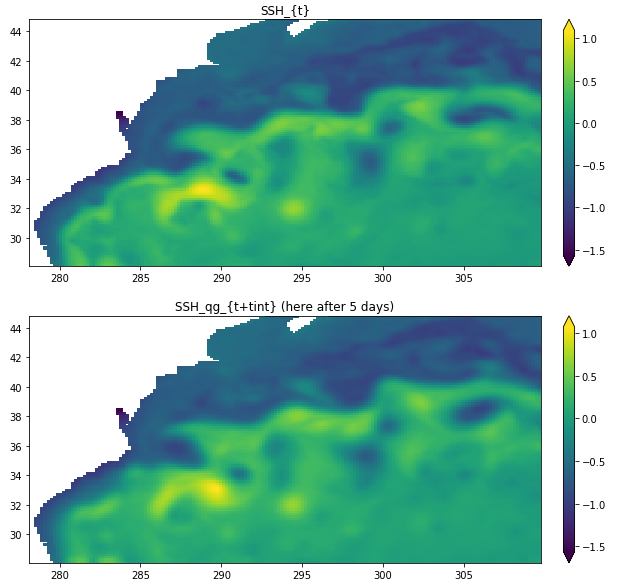

# qgsw-DI
Quasigeostrophic shallow-water model for Dynamic Interpolation of SSH

This is the supplementary material of the publication "Dynamic Interpolation of Sea Surface Height and Potential Applications for Future High-Resolution Altimetry Mapping", from C. Ubelmann et al., [pdf](https://journals.ametsoc.org/doi/abs/10.1175/JTECH-D-14-00152.1), please cite this article if you use the code in your works.

The backbone of the codes was written by Clément Ubelmann (ubelmann@cls.fr). I commented and prepared the codes for sharing, I also added a Jupyter notebook for illustration.

# Example

Please check the folder "notebooks" for more details

